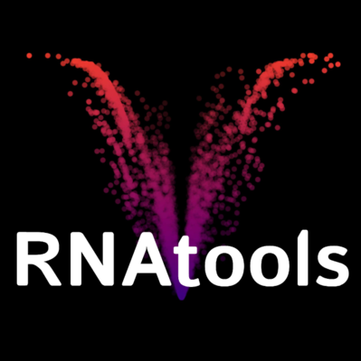
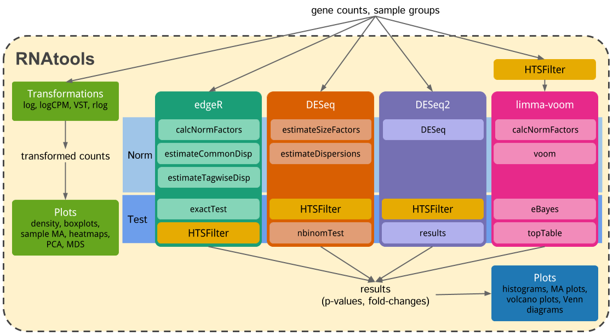

# RNAtools

An R package for performing differential expression testing on RNA-seq data using 
multiple methods. Provides consistent interfaces for normalisation, testing, 
visualisation, plotting etc.

Multiple packages exist for differential expression testing using RNA-seq data.
This package aims to provide a consistent interface to multiple packages that
allows them to be applied simultaneously to a single data set with minimal
setup. In addition consistent, easily comparable visualisations can be produced
using _ggplot2_, and _VennDiagram_ allowing for easy modification by the user.

The basic workflow is described by the flow diagram below:



## Installation

Several of the packages used by RNAtools are only available from
[Bioconductor](www.bioconductor.org) so we need to install those first.

```r
source("http://bioconductor.org/biocLite.R")
biocLite(c("edgeR", "DESeq", "DESeq2", "limma", "genefilter", "HTSFilter"))
```

RNAtools can now easily be installed from Github using the _devtools_ package.

```r
install.packages("devtools")
library("devtools")
install_github("lazappi/RNAtools")
```

If you want to make sure you can access the vignette set the `build_vignettes`
option to `TRUE`. This may take some time.

```r
install_github("lazappi/RNAtools", build_vignettes = TRUE)
```

If you are using Windows you will be prompted to also install
[Rtools](https://cran.r-project.org/bin/windows/Rtools/index.html). While
this is recommended RNAtools should install fine without it.

## Guide

See the vignette for a walkthrough of using RNAtools.

```r
library("RNAtools")
browseVignettes("RNAtools")
```

If you chose not to build the vignette, or it hasn't worked, you can download it
directly from
[here](https://github.com/lazappi/RNAtools/blob/master/inst/doc/RNAtools.html).
